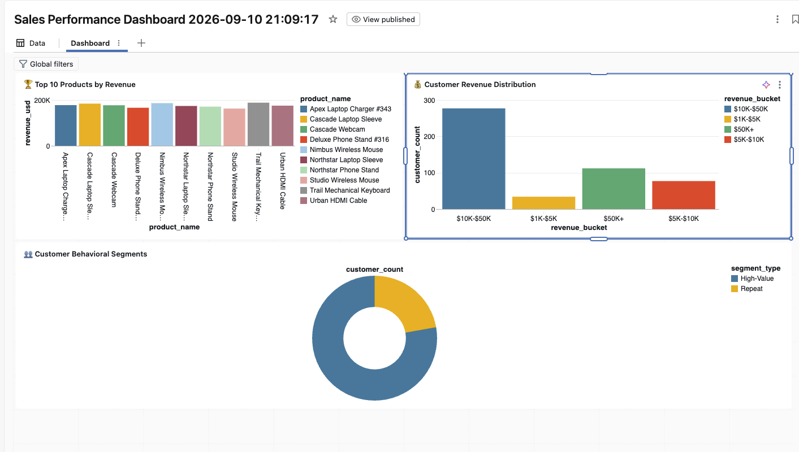

# Databricks Medallion Pipeline — E-commerce Sales

Bronze → Silver → Gold → Dashboard pipeline for an e-commerce sales use case.

**Stack:** PySpark, Delta Lake, SQL, Databricks Free Edition (Unity Catalog; no DBFS).

**How to run:** follow **[RUN_ON_DATABRICKS.md](RUN_ON_DATABRICKS.md)** (step by step).

## Source data

| File | Rows | Role |
|---|---|---|
| `data/customers.csv` | 10,000 | Customers |
| `data/orders.csv` | 100,000 | Orders (FKs → customers, products) |
| `data/products.csv` | 500 | Products |

## Layers

1. **Bronze** — raw ingest only; no cleaning or transformation.
2. **Silver** — quality checks that **flag** bad rows in `quality_check_result`; never silently drop rows.
3. **Gold** — business-ready aggregations on validated Silver data.

## Current status

- [x] Project folder structure
- [x] Synthetic generators for customers, products, and orders (`src/data_generation/generate_sample_data.py`)
- [x] Bronze ingest (`src/bronze/01_ingest_customers.py`, `02_ingest_orders.py`, `03_ingest_products.py`)
- [x] Silver completeness (`src/silver/01_quality_completeness.py`)
- [x] Silver uniqueness (`src/silver/02_quality_uniqueness.py`)
- [x] Silver referential integrity (`src/silver/04_quality_referential_integrity.py`)
- [x] Silver type validation (`src/silver/03_quality_type_validation.py`)
- [x] Silver business logic (`src/silver/05_quality_business_logic.py`)
- [x] Silver orchestrator + metrics (`src/silver/create_silver_tables.py`)
- [x] Gold sales by product (`src/gold/01_sales_by_product.sql`)
- [x] Gold revenue by customer (`src/gold/02_revenue_by_customer.sql`)
- [x] Gold customer segmentation (`src/gold/04_customer_segmentation.sql`)
- [x] Gold orchestrator (`src/gold/create_gold_tables.py`)
- [x] Dashboard queries (`src/dashboard/dashboard_queries.sql`)
- [x] Dashboard guide (`src/dashboard/DASHBOARD_GUIDE.md`)
- [x] Databricks driver (`src/run_pipeline.py` + `src/databricks_runtime.py`)
- [x] Databricks Free Edition landing (UC volume, not FileStore)
- [ ] Gold daily/weekly trends

## Documentation

| Doc | Contents |
|---|---|
| [RUN_ON_DATABRICKS.md](RUN_ON_DATABRICKS.md) | Step-by-step run on Free Edition |
| [design-notes.md](design-notes.md) | Architecture decisions |
| [data-model.md](data-model.md) | Bronze / Silver / Gold columns |
| [data-quality-strategy.md](data-quality-strategy.md) | Flags, tokens, expected counts |
| [debugging-notes.md](debugging-notes.md) | `__file__`, DBFS, RI vs nulls |
| [database/setup-notes.md](database/setup-notes.md) | Volume + cluster notes |
| [src/dashboard/DASHBOARD_GUIDE.md](src/dashboard/DASHBOARD_GUIDE.md) | Chart field mappings |

## Run on Databricks (short)

1. Import this folder into the Workspace so `data/` sits next to `src/`.
2. Open `src/run_pipeline.py`, attach compute, **Run all**.
3. Landing CSVs are copied to `/Volumes/workspace/default/ecommerce` (no DBFS).
4. Confirm counts in `RUN_ON_DATABRICKS.md` step 6.

Widgets:

| Widget | Default | Purpose |
|---|---|---|
| `source_dir` | `/Volumes/workspace/default/ecommerce` | UC Volume with the three CSVs |
| `src_root` | (auto) | Path to `src/` if auto-detect fails |

## Evidence

## Important Note: Due to having some problem with the databricks free edition login and workspace access issue had to use a single catalog.schema format for creating the tables and hence the tables are created as schema_table_name this can be altered with enough access.
